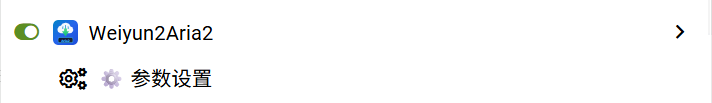
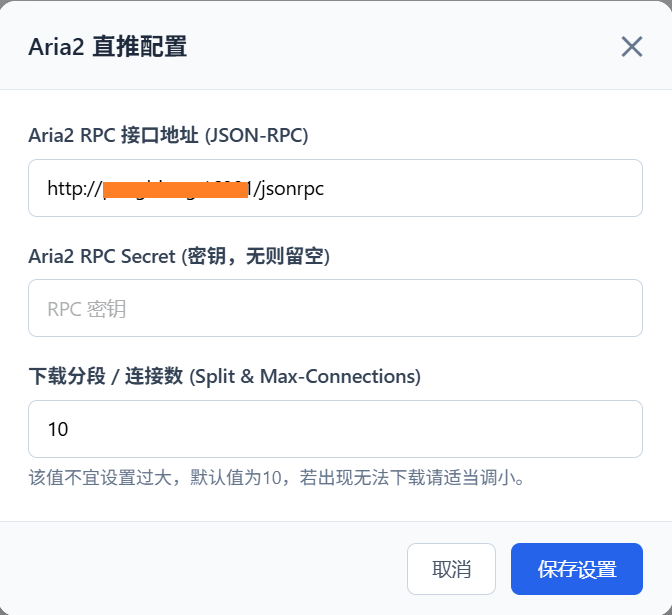
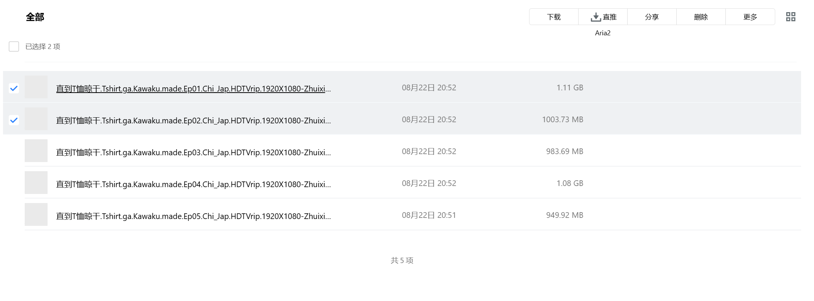
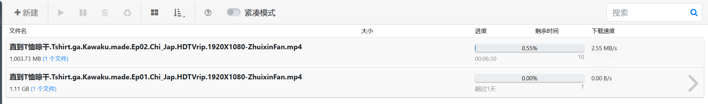

# Weiyun2Aria2

直接解析腾讯微云直链并推送到 Aria2 进行多线程下载的用户脚本。

---

### 📥 安装方式

> 请先确保浏览器已安装 [Tampermonkey](https://www.tampermonkey.net/) 或 [Violentmonkey](https://violentmonkey.github.io/) 扩展。

* [🚀 点击一键安装 / 检查更新 (GitHub Raw)](https://raw.githubusercontent.com/dq19871123/Weiyun2Aria2/main/Weiyun2Aria2.user.js)
* [⚡ 国内 CDN 加速安装源 (jsDelivr)](https://fastly.jsdelivr.net/gh/dq19871123/Weiyun2Aria2@main/Weiyun2Aria2.user.js)

---

### 📖 使用方法

1. **安装脚本**：点击上方安装链接，在油猴扩展中确认安装并保持启用状态。
2. **基本参数配置**：
   * 打开 [腾讯微云网页版](https://www.weiyun.com/disk)，点击顶部操作栏或油猴菜单中的 **「参数设置」**。
   * 配置你的 Aria2 JSON-RPC 接口地址（如 `http://127.0.0.1:6800/jsonrpc`）、密钥与下载连接数。

   

     
   

   

     
   

3. **推送下载**：
   * 在文件列表中勾选需要下载的文件（支持单选或批量全选）。
   * 点击顶部工具栏或右键菜单中的 **「直推 Aria2」** 按钮。
   * 浏览器将自动完成解析并下发任务，右上角弹出实时推送状态。

   

     
   

   

     
   

---

### 💡 注意事项

* **连接数建议**：连接数默认为10，若遇到节点限制无法下载，请适当调小连接数。

---

### 🙏 致谢

本项目受到 [WeiyunHelper (loo2k)](https://github.com/loo2k/WeiyunHelper) 的启发。
